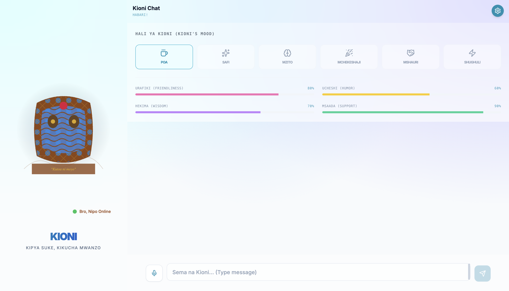
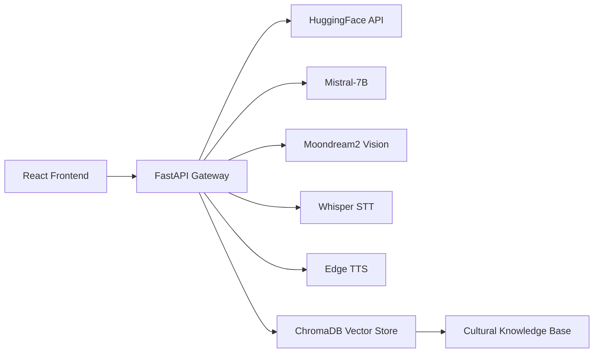

<p align="center">
    <a href="https://github.com/zuck30/kioni-ai-bro"></a>
    <a href="https://fastapi.tiangolo.com/"></a>
    <a href="https://react.dev/"></a>
    <a href="https://www.typescriptlang.org/"></a>
    <a href="https://www.python.org/"></a>
    <a href="https://github.com/zuck30/kioni-ai-bro/graphs/contributors"></a>
    <a href="https://github.com/zuck30/kioni-ai-bro/stargazers"></a>
       
</p>


<p align="center">
    <strong>Advanced AI Assistant • Cultural Intelligence • Multimodal Understanding</strong>
    <br/>
    <em>Habari, mambo?  Kioni speaks your language, understands your world.</em>
</p>

<h3>🚀 Quick Links</h3>

<div align="left">
    <a href="#-quick-start"></a>
    <a href="#-api-integration"></a>
    <a href="https://github.com/zuck30/kioni-ai-bro/issues"></a>
    <a href="https://github.com/zuck30/kioni-ai-bro/discussions"></a>
    <a href="#-license"></a>
</div>

<br>
<p align="center">
    
</p>

---

## 📖 About KIONI

**KIONI** is East Africa's first culturally-intelligent AI assistant built by African, for Africa. Unlike generic chatbots that stumble over local context, KIONI seamlessly code-switches between **Swahili, English, and Sheng**, understands East African proverbs, and responds with genuine cultural awareness.

> *"Mgeni njoo, mwenyeji apone"*  KIONI welcomes every user like a trusted local friend.

### 🎯 The Problem We Solve

| Generic AI | KIONI |
|------------|-------|
| ❌ Struggles with African names & places | ✅ Native-level cultural understanding |
| ❌ Ignores code-switching (Swahili/English) | ✅ Natural, fluid language mixing |
| ❌ No local context or humor | ✅ East African proverbs, slang, and vibes |
| ❌ Western-centric knowledge base | ✅ Trained with regional relevance |

---

## ✨ Core Capabilities

| Feature | Description | Status |
|---------|-------------|--------|
| 🗣️ **Trilingual Chat** | Natural Swahili/English/Sheng code-switching | ✅ Production |
| 👁️ **Real-time Vision** | Camera integration for visual understanding & awareness | ✅ Production |
| 🎙️ **Voice Intelligence** | Whisper STT + Edge TTS with Swahili support | ✅ Production |
| 🧠 **Cultural Knowledge** | Proverbs, local events, regional context awareness | ✅ Production |
| 🎨 **African Aesthetics** | Kitenge-themed UI with interactive animated character | ✅ Production |
| 🔌 **Developer API** | REST + WebSocket endpoints for custom integrations | ✅ Production |
| 📚 **Memory** | Persistent session context with ChromaDB | 🚧 Beta |
| 🌍 **Local News** | Real-time regional news integration | 🚧 Roadmap |

---

## 🚀 Quick Start

### Prerequisites

| Requirement | Version | Notes |
|-------------|---------|-------|
| Docker | 24.0+ | Recommended setup |
| Docker Compose | 2.20+ | Included with Docker Desktop |
| Python | 3.10-3.11 | For manual backend setup |
| Node.js | 18+ | For manual frontend setup |
| HuggingFace Token | Any tier | Required for AI models |

### 🐳 One-Click Setup (Recommended)

```bash
# Clone the repository
git clone https://github.com/zuck30/kioni-ai-bro.git
cd kioni-ai-bro

# Configure environment
cp .env.example .env
# Edit .env — add your HUGGINGFACE_TOKEN (required)

# Build and launch (first time may take 3-5 minutes)
docker-compose up --build
```

**You're live at:**
- 🌐 Frontend: `http://localhost:3000`
- ⚙️ API: `http://localhost:8000`
- 📚 API Docs: `http://localhost:8000/docs`

### 🛠️ Manual Development Setup

<details>
<summary><b>🔧 Backend Setup (FastAPI + Python)</b></summary>

```bash
cd backend

# Create virtual environment
python -m venv venv
source venv/bin/activate  # Windows: venv\Scripts\activate

# Install dependencies
pip install -r requirements.txt

# Configure environment
cp .env.example .env
# Add your HUGGINGFACE_TOKEN

# Start the server
uvicorn app.main:app --reload --port 8000
```
</details>

<details>
<summary><b>🎨 Frontend Setup (React + TypeScript)</b></summary>

```bash
cd frontend

# Install dependencies
npm install

# Start development server
npm run dev

# Build for production
npm run build
```
</details>

---

## 🔌 API Integration

Integrate KIONI's intelligence into your own applications. All endpoints are fully documented at `/docs` when running locally.

### WebSocket Chat — Real-time Conversation

```typescript
// Connect to KIONI's brain
const ws = new WebSocket('ws://localhost:8000/ws/chat/{client_id}');

// Send a message
ws.send(JSON.stringify({
  type: "chat",
  payload: {
    message: "Habari KIONI, unaweza kunisaidia kupata hoteli nzuri?",
    session_id: "your_session_id"
  }
}));

// Listen for responses
ws.onmessage = (event) => {
  const response = JSON.parse(event.data);
  console.log('KIONI says:', response.payload.message);
};
```

### REST Endpoints

| Endpoint | Method | Description | Auth |
|----------|--------|-------------|------|
| `/api/vision/camera-frame` | `POST` | Send image frames for visual analysis | Optional |
| `/api/vision/analyze` | `POST` | Analyze uploaded image with cultural context | Optional |
| `/api/voice/upload` | `POST` | Upload audio → transcription + response | Optional |
| `/api/voice/synthesize` | `POST` | Text-to-speech in Swahili/English | Optional |
| `/api/hali/update` | `POST` | Update KIONI's mood/personality | Optional |
| `/api/debug/ai-status` | `GET` | Check model health & configuration | None |

### Python Example

```python
import requests
import base64

# Send image for analysis
with open('photo.jpg', 'rb') as f:
    image_b64 = base64.b64encode(f.read()).decode()

response = requests.post(
    'http://localhost:8000/api/vision/camera-frame',
    json={'image': image_b64, 'question': 'Hii ni nini?'}
)

print(response.json()['response'])
# Output: "Hii ni mkate wa nyumbani. Inaonekana kitamu sana!"
```

---

## 🔍 System Health & Debugging

### Quick Health Check

```bash
# Check if all systems are operational
curl http://localhost:8000/api/debug/ai-status
```

**Healthy Response:**
```json
{
  "status": "operational",
  "huggingface_token": "configured ✅",
  "openrouter_key": "not configured (fallback available)",
  "models": {
    "text": "Mistral-7B-Instruct (online)",
    "vision": "Moondream2 (online)",
    "voice_stt": "Whisper (online)",
    "voice_tts": "Edge TTS (online)"
  },
  "cultural_db": "loaded (2,347 proverbs)",
  "uptime_seconds": 86400
}
```

### Troubleshooting Guide

| Error | Likely Cause | Solution |
|-------|--------------|----------|
| `422 Unprocessable Entity` | Malformed request body | Check JSON structure against `/docs` schema |
| `HuggingFace authentication error` | Invalid/expired token | Verify `HUGGINGFACE_TOKEN` in `.env` |
| `TTS package not found` | Coqui TTS version mismatch | Use Python 3.10 (compatibility confirmed) |
| `Connection refused` | Services not running | Run `docker-compose ps` to check status |
| Fallback responses only | API quota exceeded or network issue | Check internet, or switch to OpenRouter |

### Docker Management

```bash
# View logs
docker-compose logs -f backend

# Restart a specific service
docker-compose restart backend

# Rebuild after dependency changes
docker-compose up --build --force-recreate

# Clean everything (including volumes)
docker-compose down -v
```

---

## 🏗️ Architecture & Tech Stack



<div align="center">

| Layer | Technologies |
|-------|--------------|
| **Frontend** | React 18 • TypeScript 5.6 • Vite • TailwindCSS • Framer Motion • Zustand |
| **Backend** | FastAPI • Python 3.10 • WebSockets • ChromaDB • Uvicorn |
| **AI/ML** | Mistral-7B (text) • Moondream2 (vision) • Whisper (STT) • Edge TTS |
| **Infrastructure** | Docker • Docker Compose • Nginx (production) |
| **Orchestration** | HuggingFace Inference • OpenRouter (fallback) |

</div>

---

## 🤝 Contributing

We welcome contributions from the community! No contribution is too small.

### Ways to Contribute

- 🐛 **Bug reports** — Open an issue with reproduction steps
- 🌍 **Cultural knowledge** — Submit local proverbs, idioms, or context
- 🎨 **UI/UX improvements** — Enhance the Kitenge aesthetic
- 📚 **Documentation** — Fix typos or add examples
- 💻 **Code** — Submit PRs for bug fixes or features

### Development Workflow

```bash
# Fork & clone your fork
git clone https://github.com/YOUR_USERNAME/kioni-ai-bro.git
cd kioni-ai-bro

# Create a feature branch
git checkout -b feature/amazing-feature

# Make changes, then commit
git commit -m 'Add amazing feature'

# Push to your fork
git push origin feature/amazing-feature

# Open a Pull Request
```

---

## 🙏 Acknowledgments

- **Mistral AI** & **HuggingFace** — Open-weight models enabling local-first AI
- **East African Community** — Cultural inspiration and linguistic guidance
- **Open Source Community** — All the libraries that make KIONI possible

---

<div align="center">
    <br/>
    <br/>
    <sub>🇹🇿 🇰🇪 🇺🇬 🇷🇼 🇧🇮 🇸🇸 🇨🇩</sub>
    <br/>
    <br/>
    <sub>⭐ Star this repo if KIONI made you smile</sub>
</div>
