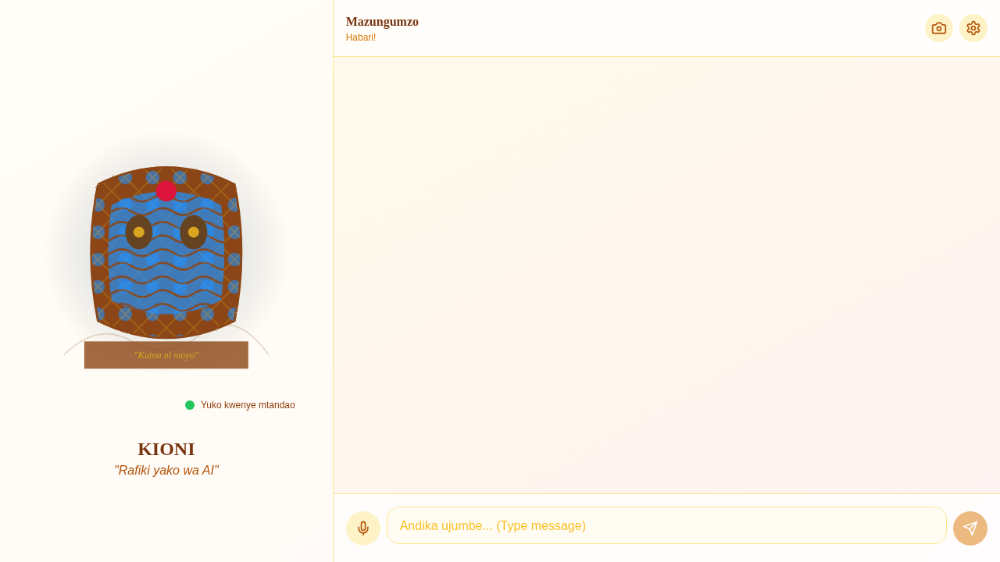

# KIONI Your Swahili-Speaking AI Bro 🇹🇿🇰🇪 

Kioni is an advanced, culturally-aware AI assistant designed for the East African context. He speaks Swahili, English, and Sheng, and features a unique Kitenge-inspired visual interface.



## 🌟 Features

- 🗣️ **Bilingual Chat** - Natural Swahili/English/Sheng code-switching.
- 👁️ **Vision** - Real-time camera integration for visual context and awareness.
- 🎙️ **Voice** - High-quality speech-to-text (Whisper) and text-to-speech (TTS) in Swahili.
- 🎨 **African Aesthetics** - Beautiful Kitenge-themed UI with an interactive animated character.
- 🧠 **Cultural Intelligence** - Understands East African context, proverbs, and local vibes.

---

## 🚀 Step-by-Step Setup

### 1. Prerequisites
- **Docker & Docker Compose** (Recommended)
- **Node.js** (v18+) & **Python** (3.10+) if running locally.
- **HuggingFace API Token** ([Get it here](https://huggingface.co/settings/tokens))

### 2. Environment Configuration
Clone the repository and set up your environment variables:

```bash
git clone https://github.com/zuck30/kioni-ai-bro.git
cd kioni-ai-bro
cp .env.example .env
```

Edit the `.env` file and add your `HUGGINGFACE_TOKEN`.

### 3. Running with Docker (Quickest)
The easiest way to get Kioni running is using Docker Compose:

```bash
docker-compose up --build
```
- Frontend will be available at `http://localhost:3000`
- Backend API will be available at `http://localhost:8000`

### 4. Local Manual Setup

#### Backend Setup
```bash
cd backend
python -m venv venv
source venv/bin/activate  # On Windows: venv\Scripts\activate
pip install -r requirements.txt
uvicorn app.main:app --reload --port 8000
```

#### Frontend Setup
```bash
cd frontend
npm install
npm run dev
```

---

## 🔌 Outside Integration

Kioni is designed to be extensible. You can integrate Kioni's intelligence into your own applications using its REST API or WebSockets.

### WebSocket Chat Integration
Connect to Kioni's brain via WebSockets for real-time interaction:

**Endpoint:** `ws://localhost:8000/ws/chat/{client_id}`

**Sample JSON Message:**
```json
{
  "type": "chat",
  "payload": {
    "message": "Habari Kioni, unafanya nini?",
    "session_id": "your_session_id"
  }
}
```

### REST API Endpoints
- **POST `/api/vision/camera-frame`**: Send image frames for visual analysis.
- **POST `/api/voice/upload`**: Upload audio files for transcription and Swahili response.
- **POST `/api/hali/update`**: Update Kioni's mood and personality traits.

## 🔍 Troubleshooting & AI Status

If Kioni is not responding correctly or giving fallback "brain nap" responses, you can check the status of the AI models and API keys:

1. **Check AI Status Endpoint**:
   Visit `http://localhost:8000/api/debug/ai-status` in your browser.
   This will return a JSON showing:
   - If `HUGGINGFACE_TOKEN` and `OPENROUTER_API_KEY` are detected.
   - Connectivity status to Hugging Face and OpenRouter.
   - Which models are currently configured.

2. **Common Issues**:
   - **422 Unprocessable Entity**: Usually means the request body is missing or formatted incorrectly. (Fixed in latest version for vision frames).
   - **"Warning: TTS package not found"**: Coqui TTS requires Python 3.9-3.11. If you are on Python 3.12, voice responses will be disabled unless you use a compatible environment.
   - **Fallback Responses**: If both Hugging Face and OpenRouter fail (e.g., due to rate limits or invalid tokens), Kioni will use a simple rule-based response.

---

## 🛠️ Tech Stack

- **Frontend**: React, TypeScript, Vite, Tailwind CSS, Framer Motion, Zustand.
- **Backend**: FastAPI (Python), WebSockets.
- **AI/ML**:
  - **Text**: Mistral-7B / Zephyr (via HuggingFace).
  - **Voice**: OpenAI Whisper (STT) & Coqui TTS (Swahili).
  - **Vision**: Moondream2.
  - **Vector DB**: ChromaDB for cultural memory.

---

## 📂 Project Structure

- `/frontend`: React application, UI components, and Kitenge animations.
- `/backend`: FastAPI server, AI model integrations, and WebSocket handlers.
- `/docs`: Documentation assets and images.

---

## 🤝 Contributing
Contributions are welcome! Please feel free to submit a Pull Request.

## 📄 License
MIT License - See [LICENSE](LICENSE) for details.
