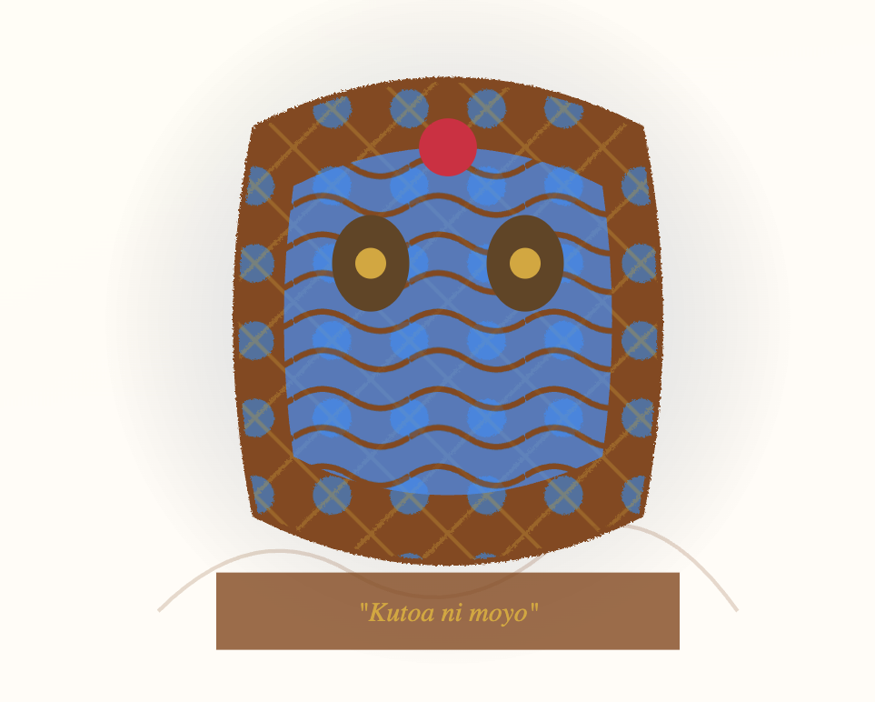

Here's a clean, modern README for Kioni:

---

<div align="center">
  
  
  # KIONI
  
  <h3>Your Swahili-Speaking AI Bro 🇹🇿🇰🇪</h3>

  <p>
    <strong>Kioni</strong> is an advanced, culturally-aware AI assistant designed for the East African context. 
    He speaks Swahili, English, and Sheng, featuring a unique Kitenge-inspired visual interface.
  </p>

  <br/>

  <div>
    
    
    
    
    
  </div>
</div>

<br/>

## ✨ Features

| | |
|---|---|
| 🗣️ **Bilingual Chat** | Natural Swahili/English/Sheng code-switching with cultural context |
| 👁️ **Vision** | Real-time camera integration for visual understanding and awareness |
| 🎙️ **Voice** | High-quality speech-to-text (Whisper) and text-to-speech (TTS) in Swahili |
| 🎨 **African Aesthetics** | Beautiful Kitenge-themed UI with an interactive animated character |
| 🧠 **Cultural Intelligence** | Deep understanding of East African context, proverbs, and local vibes |

<br/>

## 🚀 Quick Start

### Prerequisites
- [Docker](https://docker.com/) & [Docker Compose](https://docs.docker.com/compose/) (recommended)
- [HuggingFace API Token](https://huggingface.co/settings/tokens)

### One-Click Setup with Docker

```bash
# Clone the repository
git clone https://github.com/zuck30/kioni-ai-bro.git
cd kioni-ai-bro

# Configure environment
cp .env.example .env
# Edit .env and add your HUGGINGFACE_TOKEN

# Launch Kioni
docker-compose up --build
```

Access your local instance:
- 🌐 Frontend: `http://localhost:3000`
- ⚙️ Backend API: `http://localhost:8000`

### Manual Setup

<details>
<summary><b>Backend</b></summary>

```bash
cd backend
python -m venv venv
source venv/bin/activate  # Windows: venv\Scripts\activate
pip install -r requirements.txt
uvicorn app.main:app --reload --port 8000
```
</details>

<details>
<summary><b>Frontend</b></summary>

```bash
cd frontend
npm install
npm run dev
```
</details>

<br/>

## 🔌 Integration APIs

Kioni is built for extensibility. Integrate his intelligence into your own applications:

### WebSocket Chat
```javascript
// Connect to Kioni's brain
const ws = new WebSocket('ws://localhost:8000/ws/chat/{client_id}');

// Send a message
ws.send(JSON.stringify({
  type: "chat",
  payload: {
    message: "Habari Kioni, unafanya nini?",
    session_id: "your_session_id"
  }
}));
```

### REST Endpoints

| Endpoint | Method | Description |
|----------|--------|-------------|
| `/api/vision/camera-frame` | `POST` | Send image frames for visual analysis |
| `/api/voice/upload` | `POST` | Upload audio for transcription & Swahili response |
| `/api/hali/update` | `POST` | Update Kioni's mood and personality |

<br/>

## 🔍 System Health & Debugging

Check if Kioni's AI models are responding:

```bash
# Quick health check
curl http://localhost:8000/api/debug/ai-status
```

**Sample response:**
```json
{
  "huggingface_token": "configured",
  "openrouter_key": "configured",
  "models": {
    "text": "Mistral-7B (online)",
    "vision": "Moondream2 (online)",
    "voice": "Whisper + Coqui TTS"
  }
}
```

### Common Issues

| Issue | Solution |
|-------|----------|
| `422 Unprocessable Entity` | Check request body formatting (fixed in latest version) |
| `TTS package not found` | Use Python 3.9-3.11 for Coqui TTS compatibility |
| Fallback responses | Verify `HUGGINGFACE_TOKEN` or switch to OpenRouter |

<br/>

## 🛠️ Tech Stack

<div align="center">

| Frontend | Backend | AI/ML |
|----------|---------|-------|
| React + TypeScript | FastAPI | Mistral-7B / Zephyr |
| Vite | WebSockets | Whisper (STT) |
| Tailwind CSS | Python 3.10+ | Coqui TTS |
| Framer Motion | ChromaDB | Moondream2 (Vision) |
| Zustand | Docker | HuggingFace |

</div>

<br/>

## 📁 Project Structure

```
kioni-ai-bro/
├── frontend/           # React app with Kitenge animations
│   ├── src/
│   └── public/
├── backend/            # FastAPI server & AI integrations
│   ├── app/
│   └── requirements.txt
├── docs/               # Documentation assets
├── banner/             # Project banners
└── docker-compose.yml
```

<br/>

## 🤝 Contributing

We welcome contributions! Whether it's:
- 🐛 Bug fixes
- 🌍 Additional cultural knowledge
- 🎨 UI/UX improvements
- 📚 Documentation

See our [Contributing Guide](CONTRIBUTING.md) to get started.

<br/>

## 📄 License

MIT © [zuck30](https://github.com/zuck30)

---

<div align="center">
  <sub>Built with ❤️ for East Africa</sub>
  <br/>
  <sub>🇹🇿 🇰🇪 🇺🇬 🇷🇼 🇧🇮</sub>
</div>

---